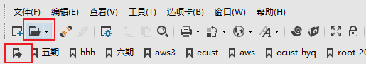

## [**英文 English (not finished)**](./README_en.md)

- [1. 须知（重点）](#1-须知重点)
- [2. 服务器信息](#2-服务器信息)
  - [2.1. 队列信息](#21-队列信息)
  - [2.2. 计算节点信息](#22-计算节点信息)
  - [2.3. 常用目录](#23-常用目录)
  - [2.4. 用户间传递文件](#24-用户间传递文件)
- [3. 账号](#3-账号)
- [4. 登录](#4-登录)
  - [4.1. 登录节点](#41-登录节点)
  - [4.2. SSH](#42-ssh)
    - [4.2.1. 终端登录](#421-终端登录)
    - [4.2.2. 客户端](#422-客户端)
    - [4.2.3. 文件传输](#423-文件传输)
  - [4.3. Tmux](#43-tmux)
    - [4.3.1. 是什么](#431-是什么)
    - [4.3.2. 基本使用](#432-基本使用)
    - [4.3.3. 会话管理](#433-会话管理)
    - [4.3.4. 基本操作流程](#434-基本操作流程)
    - [4.3.5. 窗格操作](#435-窗格操作)
    - [4.3.6. 其他命令](#436-其他命令)
- [5. 环境配置](#5-环境配置)
  - [5.1. 初始化](#51-初始化)
  - [5.2. 软件](#52-软件)
    - [5.2.1. 编译器和并行库](#521-编译器和并行库)
    - [5.2.2. 高斯](#522-高斯)
    - [5.2.3. MATLAB](#523-matlab)
    - [5.2.4. USPEX](#524-uspex)
    - [5.2.5. amber](#525-amber)
    - [5.2.6. tinker](#526-tinker)
    - [5.2.7. VMD](#527-vmd)
    - [5.2.8. vasp](#528-vasp)
    - [5.2.9. fftw](#529-fftw)
    - [5.2.10. python](#5210-python)
    - [5.2.11. anaconda](#5211-anaconda)
    - [5.2.12. gromacs](#5212-gromacs)
  - [5.3. 额外软件安装](#53-额外软件安装)
- [6. 任务提交](#6-任务提交)
  - [6.1. PBS脚本提交](#61-pbs脚本提交)
  - [6.2. 命令行任务](#62-命令行任务)
  - [6.3. 任务注意事项](#63-任务注意事项)
    - [6.3.1. 计算节点外置目录`/data`使用](#631-计算节点外置目录data使用)
    - [6.3.2. 任务脚本内环境配置](#632-任务脚本内环境配置)
  - [6.4. 计算节点外置存储使用](#64-计算节点外置存储使用)
- [7. Torque (pbs) 相关介绍](#7-torque-pbs-相关介绍)
- [8. shell(bash)相关介绍](#8-shellbash相关介绍)
  - [8.1. 常用命令](#81-常用命令)
  - [8.2. 入门资料](#82-入门资料)
> HYQ, 20200908
# 1. 须知（重点）
- **禁止登录节点运行计算任务！！!**

# 2. 服务器信息

## 2.1. 队列信息
目前共有三个主要队列。

| queues    | total nodes    |   cores per node  |  max walltime   |  priority   |
| --- | --- | --- | --- | --- |
|  job   |  18   | 24    | 480    |  middle   |
| huge    | 14    |   48  |  960   |  low   |
|  short   |   2  |  24/48   |  24   |  high   |

## 2.2. 计算节点信息
- 计算节点名称格式为为`compute-0-1`，`rocks list host`可以列出所有节点。
- 每个节点内存64G
- 主存储66T所有节点共用，计算节点单独有4T外置存储

## 2.3. 常用目录
- 存储总共66T，所有节点共用
- 每个计算节点拥有额外4T存储，目录`/data`, 登录节点无法访问，任务使用外置存储参考上一条
- 一些配置文件备份在`/template`
- 公共软件安装再 `/export/apps`，
- 用户自己安装软件想所用用户可用的话也可以安装在 `/export/home/soft`

## 2.4. 用户间传递文件
用户之间不能相互读取数据，传递数据可以通过中转目录`/export/home/usertemp`。
比如用户A传目录`~/temp`给B, 则A先复制目录到中转目录，B用户再拷贝到自己目录，A再删除中转目录中相应的文件，命令示例如下：
```bash
# user A
cp -r ~/temp /export/home/usertemp

#user B
cp -r /export/home/usertemp/temp .

# user A
rm -r /export/home/usertemp/temp
```


# 3. 账号
初始账号用户名可自定义指定，之后不能更改。
首次连接后建议修改初始密码：

- 输入`passwd`命令，
- 根据提示输入，
- 输入时终端没有显示，但输入是有效的

# 4. 登录
## 4.1. 登录节点
外网登录节点为：`202.120.xxx.xxx`，端口：`xxxx`
200号内网（包括有线连接和lab200无线）登录ip为：`192.168.1.1`， 端口：`22`


注意事项:

- 计算任务使用pbs脚本提交
- 不要在登录节点运行计算任务！
- 编译代码控制并行数（如`make -j`后面的数字控制在4以内）

## 4.2. SSH
SSH登录需要输入登录节点IP，端口，用户名和密码
> 也可以设置无密码登录（密钥对），自行搜索教程

### 4.2.1. 终端登录
Linux/Mac终端以及Win powershell可以使用命令行方式登录, 比如：

```bash
$ ssh [-p xxx] username@ip
$ ssh -p 23333 uuu@202.120.39.110
```

### 4.2.2. 客户端
Windows推荐使用客户端登录：

- xmanager：大而全，商业软件,集成了文件传输，虚拟图形界面等
- [putty](https://www.putty.org/)：开源小巧

下图演示xmanager（xshell）登录过程 (putty使用方式类似)：




### 4.2.3. 文件传输
- xmanager（xshell）连接后可以直接传输，如下图：
- 


- 其他连方式接的可以使用[Winscp](https://winscp.net/eng/index.php)建立文件传输连接（免费软件，可视化操作）

- 或者直接通过命令行使用`scp`命令（Linux/Mac终端，windows powershell都可）：

```bash
# 下面的命令将远程文件file下载到本地当前文件夹：
scp [-P xxx] username@ip:path/file ./

# 下面的命令将远程文件夹folder下载到本地当前文件夹：
scp -r [-P xxx] username@ip:path/folder ./

# 下面的命令将本地文件file上传到远程目录folder中：
scp [-P xxx] path/file username@ip:path/folder/
```

## 4.3. Tmux
### 4.3.1. 是什么
命令行的典型用法是打开终端（terminal）后，在里面输入指令。用户的这种与计算机交互的手段，称为**会话**（session）。

在会话中，通过命令行启动的所有进程均与会话进程绑定。当会话进程终止时，该会话启动的所有进程也会随之强行结束。最常见的例子就是通过SSH连接到远程计算机。当SSH连接因为网络等原因断开时，那么SSH会话就被终止，这次会话启动的任务也会被强制结束。

为了解决这个问题，一种手段就是用户终端窗口与会话"解绑"。即关闭用户端窗口，仍然维持该会话，进而保证用户进程不变。

- 它允许在单个窗口中，同时访问多个会话。这对于同时运行多个命令行程序很有用。
- 它可以让新窗口"接入"已经存在的会话。
- 它允许每个会话有多个连接窗口，因此可以多人实时共享会话。
- 它还支持窗口任意的垂直和水平拆分

### 4.3.2. 基本使用
```bash
# 启动
$ tmux

# 退出
$ exit
```

### 4.3.3. 会话管理
- 启动的tmux窗口从0开始编号，可以在启动的时候指导窗口名称，比如启动一个新窗口，并命名为session-name：`tmux new -s session-name`
- 分离会话：按下`Ctrl+b d`或者输入`tmux detach`命令，就会将当前会话与窗口分离。执行命令后会退出当前窗口，但会话和里面的进程仍在后台运行。
- `tmux ls`命令可以查看当前所有的 Tmux 会话。

```bash
$ tmux ls
# or
$ tmux list-session
```

- 接入会话：`tmux attach`命令用于重新接入某个已存在的会话。

```bash
# 使用会话编号
$ tmux attach -t 0

# 使用会话名称
$ tmux attach -t <session-name>
```

- 杀死会话：`tmux kill-session`命令用于杀死某个会话。

```bash
# 使用会话编号
$ tmux kill-session -t 0

# 使用会话名称
$ tmux kill-session -t <session-name>
```

- 切换会话：`tmux switch`命令用于切换会话。

```bash
# 使用会话编号
$ tmux switch -t 0

# 使用会话名称
$ tmux switch -t <session-name>
```

- 重命名会话：`tmux rename-session`命令用于重命名会话。

```bash
$ tmux rename-session -t 0 <new-name>
```

- 会话快捷键

```
`Ctrl+b d`：分离当前会话。
`Ctrl+b s`：列出所有会话。
`Ctrl+b $`：重命名当前会话。
```

### 4.3.4. 基本操作流程

1. 新建会话`tmux new -s my_session`。
2. 在 Tmux 窗口运行所需的程序。
3. 按下快捷键`Ctrl+b d`将会话分离。
4. 下次使用时，重新连接到会话`tmux attach-session -t my_session`。

### 4.3.5. 窗格操作
Tmux 可以将窗口分成多个窗格（pane），每个窗格运行不同的命令。以下命令都是在 Tmux 窗口中执行。

- 划分窗格：`tmux split-window`命令用来划分窗格。

```bash
# 划分上下两个窗格
$ tmux split-window

# 划分左右两个窗格
$ tmux split-window -h
```

- 移动光标：`tmux select-pane`命令用来移动光标位置。

```bash
# 光标切换到上方窗格
$ tmux select-pane -U

# 光标切换到下方窗格
$ tmux select-pane -D

# 光标切换到左边窗格
$ tmux select-pane -L

# 光标切换到右边窗格
$ tmux select-pane -R
```

- 交换窗格：`tmux swap-pane`命令用来交换窗格位置。

```bash

# 当前窗格上移
$ tmux swap-pane -U

# 当前窗格下移
$ tmux swap-pane -D
```

- 窗格快捷键

```
$ Ctrl+b %：划分左右两个窗格。
$ Ctrl+b "：划分上下两个窗格。
$ Ctrl+b <arrow key>：光标切换到其他窗格。<arrow key>是指向要切换到的窗格的方向键，比如切换到下方窗格，就按方向键↓。
$ Ctrl+b ;：光标切换到上一个窗格。
$ Ctrl+b o：光标切换到下一个窗格。
$ Ctrl+b {：当前窗格左移。
$ Ctrl+b }：当前窗格右移。
$ Ctrl+b Ctrl+o：当前窗格上移。
$ Ctrl+b Alt+o：当前窗格下移。
$ Ctrl+b x：关闭当前窗格。
$ Ctrl+b !：将当前窗格拆分为一个独立窗口。
$ Ctrl+b z：当前窗格全屏显示，再使用一次会变回原来大小。
$ Ctrl+b Ctrl+<arrow key>：按箭头方向调整窗格大小。
$ Ctrl+b q：显示窗格编号。
```

### 4.3.6. 其他命令

```bash

# 列出所有快捷键，及其对应的 Tmux 命令
$ tmux list-keys

# 列出所有 Tmux 命令及其参数
$ tmux list-commands

# 列出当前所有 Tmux 会话的信息
$ tmux info

# 重新加载当前的 Tmux 配置
$ tmux source-file ~/.tmux.conf
```

# 5. 环境配置

## 5.1. 初始化
- 在`/template`目录下有`bashrc_ex`文件（包含部分软件路径），可参考设置用户目录下`.bashrc`文件，将需要内容复制到`.bashrc`，根据需要删掉注释。然后键入`source ~/.bashrc`命令使修改生效。
    > 如果source没有生效，可以另开一个shell窗口/重新连接

```bash
cp /template/bashrc_ex .bashrc
source .bashrc
```

- （非必须）`/template`目录下的`vimrc`是vim配置示例，可以仿照修改自己用户目录下的`.vimrc`。
    > 配置为tab转换成4个空格，换行自动缩进，`:wq`映射到`space wq`等

## 5.2. 软件
> 需要自行修改配置文件`~/.bashrc`

### 5.2.1. 编译器和并行库

- GNU默认版本较低，不支持c++11， 安装了gcc7.3, 可通过配置文件控制是否生效
- intel编译器和并行库全套（parallel_studio_xe_2019.5.075，`/share/apps/intel2019`）
- openmpi额外提供1.6，2.1和3.1版本（正常使用默认就可以，需要编译其他软件如vasp时推荐2.1）


### 5.2.2. 高斯

- 默认提供高斯g09，`/share/apps/g09`，可以修改为g16`/share/apps/g16`

### 5.2.3. MATLAB

- matlab2014b

### 5.2.4. USPEX
- uspex9.4

### 5.2.5. amber
> 编译可能有问题，导致跨节点并行不能用。所以目前只能单节点内并行，需要多节点的可以在用户目录下自行编译vasp

- 默认amber16，需要openmpi，将配置文件中的下面命令取消注释，并且注释掉其他并行库
```
export AMBERHOME=/share/apps/amber16-openmpi
export PATH=$PATH:$AMBERHOME/bin
test -f /share/apps/amber16-openmpi/amber.sh && source /share/apps/amber16-openmpi/amber.sh
```

### 5.2.6. tinker

- tinker-8.4

### 5.2.7. VMD

- vmd-1.9, 建议本地可视化，服务器端使用命令行

### 5.2.8. vasp

- vasp5.3（vasp）
    > 需要openmpi2.1,和Intel mkl

- vasp5.4（vasp_std）
    > 需要openmpi2.1
- LDA,PBE赝势文件在vasp安装目录下opt内

### 5.2.9. fftw

- mpi并行版fftw3.3.7

### 5.2.10. python

- python2.7目录：`/usr/local/bin/python2.7`
- 2.6可用`python2.6`调用,目录：`/usr/bin`
- 3.6可用`python3`，`python3.6`调用，目录：`/share/apps/python3.6/bin`

### 5.2.11. anaconda
> 如果使用较多，推荐在自己目录重装一个

- 提供anaconda2.7和3.6
- 默认2.7
- 安装了pymol
- 推荐创建一个自己的环境再在这个环境中安装包（避免权限问题）
    > anaconda创建的环境仅自己可用，目录在`~/.conda/`下，配置文件为`.condarc`，默认源速度很慢，可自行添加镜像源，`/template/condarc`内添加了清华和中科大源，可直接通过`cp /template/condarc ~/.condarc`生效  
    > 普通用户可以安装包（所有用户生效），但无法卸载及某些更新  
    > 创建的新环境仅当前用户生效

### 5.2.12. gromacs
- gromacs-2018

## 5.3. 额外软件安装
- 公共软件安装再 `/export/apps/soft`，
- 用户自己安装软件想所用用户可用的话也可以安装在 `/export/home/soft`


# 6. 任务提交
任务调度系统为Torque，如无特殊情况一律使用PBS脚本提交任务。

## 6.1. PBS脚本提交
- 在`/template`目录下有脚本文件`run.sh`，可以参考里面的内容，
- 提交任务使用`qsub script-name`，之后会得到一个job_id
- 删除任务，`qdel job_id`
- 查看任务，`qstat` 或 `qstat -u user_name`


- 串行作业

```bash
#!/bin/bash -x

#PBS -N jobname
#PBS -l nodes=1:ppn=24
#PBS -l walltime=120:00:00
#PBS -j oe
#PBS -q job

#  goto the dir where you submit the job
cd $PBS_O_WORKDIR

# commands
./commands
```

- 并行作业

```bash
#!/bin/bash -x

#PBS -N jobname
#PBS -l nodes=1:ppn=24
#PBS -l walltime=120:00:00
#PBS -j oe
#PBS -q job

#  goto the dir where you submit the job
cd $PBS_O_WORKDIR

# create hostfile
rm -f hostfile  hostfile2
touch hostfile  hostfile2
cat $PBS_NODEFILE | sort | uniq >> hostfile2
sort hostfile2 > hostfile
rm hostfile2

# commands
mpirun -machinefile hostfile -n 6 ./commands
```

- PBS parameters

|            TORQUE directive             |                                          Description                                           |
| --------------------------------------- | ---------------------------------------------------------------------------------------------- |
| #PBS -k o                               | Keeps the job output                                                                           |
| #PBS -l nodes=1:ppn=1,walltime=00:30:00 | Indicates the job requires one node, one processor per node, and 30 minutes of wall-clock time |
| #PBS -M name@edu.cn                | Sends job-related email to name@edu.cn                                                    |
| #PBS -m abe                             | Sends email if the job is (a) aborted, when it (b) begins, and when it (e) ends                |
| #PBS -N JobName                         | Names the job JobName                                                                          |
| #PBS -j oe                              | Joins standard output and standard error                                                       |
| #PBS -q standby                         | Submit the job on the standby queue                                                            |


## 6.2. 命令行任务
如果需要手动运行一些测试或者简单的任务，或者需要交互的命令行任务，不允许在主节点运行，可以提交空任务分配节点后，再登录到计算节点运行。
1. 准备任务脚本如`sleep.sh`：参考任务脚本，将最后的命令换成`sleep xxx`, xxx是时间，单位是秒
2. 提交任务`qsub sleep.sh`
3. 任务正常运行后，查看分配的节点，`qstat -f job_id`，比如节点是`compute-0-1`
4. 远程连接计算节点，`ssh compute-0-1` (注意更换为占据的节点名称)
5. 进入需要的目录，运行任务

## 6.3. 任务注意事项
### 6.3.1. 计算节点外置目录`/data`使用

```bash
#!/bin/bash -x

#PBS -N jobname
#PBS -l nodes=1:ppn=24
#PBS -l walltime=120:00:00
#PBS -j oe
#PBS -q job

# create temp dir in /data, go to this dir, copy all files needed to this dir, 
# run, move all files back to job dir, remove the dir in /data
export WORKDIR=/data/${PBS_JOBID}
mkdir $WORKDIR
cd $WORKDIR
cp $PBS_O_WORKDIR/*  .

#command
./commands

mv * $PBS_O_WORKDIR/
rm $WORKDIR
```

### 6.3.2. 任务脚本内环境配置
某些情况下需要在任务脚本内配置软件环境，比如不同脚本所需的环境不一样。可以直接按照`~/.bashrc`文件内的软件环境格式添加到任务脚本中。

```bash
#!/bin/bash -x

#PBS -N jobname
#PBS -l nodes=1:ppn=24
#PBS -l walltime=120:00:00
#PBS -j oe
#PBS -q job

#  goto the dir where you submit the job
cd $PBS_O_WORKDIR

# intel mpi/compiler/mkl
source /share/apps/intel2019/compilers_and_libraries_2019.5.281/linux/bin/compilervars.sh intel64
source /share/apps/intel2019/compilers_and_libraries_2019.5.281/linux/mpi/intel64/bin/mpivars.sh
source /share/apps/intel2019/compilers_and_libraries_2019.5.281/linux/mkl/bin/mklvars.sh intel64

#gaussian path
export g09root=/share/apps
source $g09root/g09/bsd/g09.profile
export GAUSS_SCRDIR=/data

# commands
./commands
```

## 6.4. 计算节点外置存储使用
- 默认所有任务共享存储，总计66T. 另外在每个计算节点都有4T的外置存储，目录`/data`，如果读写量大或者频繁的任务可以通过使用外置存储提高速度。
- 在`/template`目录下有脚本文件`run.sh2`，具体可以参考里面的内容
- 流程是先在`/data`目录下创建新的目录，为了防止冲突，一般以任务id为目录名称，
- 将所有任务文件复制到新的目录
- `cd`到新目录运行命令
- 命令结束`mv`所有文件回原始目录


# 7. Torque (pbs) 相关介绍
Terascale Open-source Resource and QUEue Manager (TORQUE) 是一个分布式计算节点和批处理作业的资源调度系统，常在高性能计算集群中用于计算作业的提交和管理。用户可以使用TORQUE将计算作业提交到不同计算队列，常用的命令包括qsub(提交作业), qstat(作业状态查询)和qdel(删除作业)。[官方文档](https://support.adaptivecomputing.com/hpc-cloud-support-portal/)

- 作业提交和管理命令

|  命令   |       功能       |     使用说明      |       示例       |
| ------- | --------------- | ---------------- | ---------------- |
| `qsub`  | 提交pbs作业      | qsub \[script\]  | `$ qsub job.pbs` |
| `qdel`  | 删除pbs作业      | qdel \[job_id\]  | `$ qdel 12345`   |
| `qhold` | 挂起pbs作业      | qhold \[job_id\] | `$ qhold 12345`  |
| `qrls`  | 释放挂起的pbs作业 | qrls \[job_id\]  | `$ qrls 12345`   |


- Environment variables

|    Variable     |                                              Description                                               |
| --------------- | ------------------------------------------------------------------------------------------------------ |
| PBS\_O\_HOST    | the name of the host upon which the qsub command is running.                                           |
| PBS_SERVER      | the hostname of the pbs_server which qsub submits the job to.                                          |
| PBS\_O\_QUEUE   | the name of the original queue to which the job was submitted.                                         |
| PBS\_O\_WORKDIR | the absolute path of the current working directory of the qsub command.                                |
| PBS_ARRAYID     | each member of a job array is assigned a unique identifier (see -t)                                    |
| PBS_ENVIRONMENT | if set to PBS\_BATCH is a batch job, if set to PBS\_INTERACTIVE is an interactive job.                 |
| PBS_JOBID       | the job identifier assigned to the job by the batch system.                                            |
| PBS_JOBNAME     | the job name supplied by the user.                                                                     |
| PBS_NODEFILE    | the name of the file contain the list of nodes assigned to the job (for parallel and cluster systems). |
| PBS_QUEUE       | the name of the queue from which the job is executed.                                                  |

- 作业状态查询

|        命令        |         说明         |
| ------------------ | -------------------- |
| `qstat -q`         | 列出所有队列          |
| `qstat -a`         | 列出所有作业          |
| `qstat -u user_id` | 列出user_id的所有作业 |
| `qstat -r`         | 列出所有正在运行的作业 |
| `qstat -f job_id`  | 列出作业job_id的信息  |
| `qstat -fQ queue`  | 列出队列queue的信息   |
| `qstat -B`         | 列出所有作业状态的汇总 |
| `pbsnodes`         | 列出所有节点的详细信息 |
| `pbsnodes -l free` | 列出所有空闲节点      |

- 作业控制（排队中的作业）

|  命令  |      说明       |    语法     |
| ------ | -------------- | ----------- |
| qhold  | 挂起一个作业     | qhold JOBID |
| qrls   | 释放挂起的作业   | qrls JOBID  |
| showq  | 显示作业状态信息 | showq       |
| qdel   | 取消作业        | qdel JOBID  |
| qalter | 修改作业信息     |             |

# 8. shell(bash)相关介绍
## 8.1. 常用命令


## 8.2. 入门资料
[The Linux Command Line](http://linuxcommand.org/tlcl.php)


